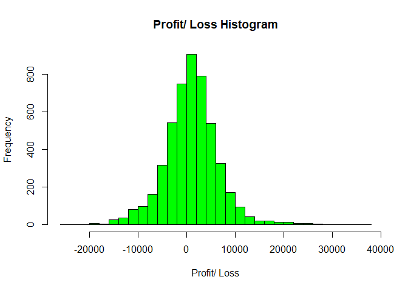
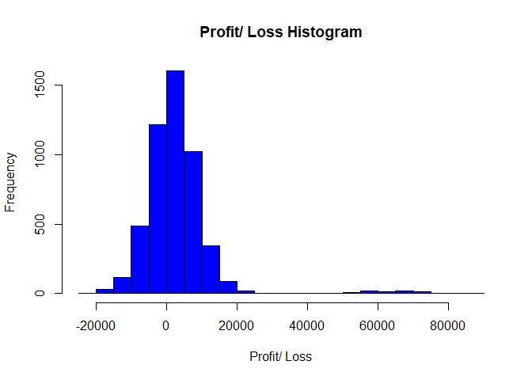
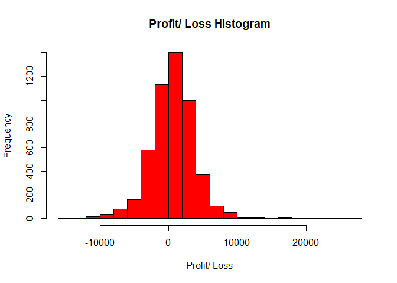
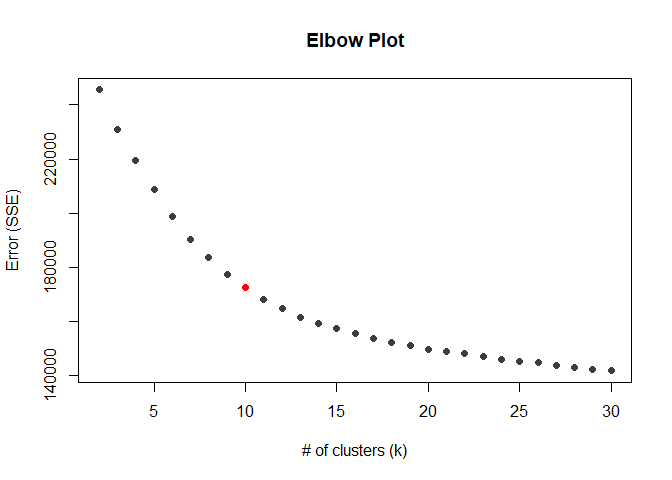

# **Question 1** Visual Story Telling Part 1: *Green Buildings*
FOR: Austin Real-Estate Developer


Unfortunately, your instincts were correct. The excel guru has made a couple of key errors while analyzing your real estate data:

## Mistake 1: Dropping leasing rates below 10%

From the boxplots below, you can see that most leasing rates are above 75%, and green buildings leasing rates are above 85%. So this calls me to question where the 10% came from. If you wanted to 'cut off' the outliars (all the dots in the boxplots), you would make drop any leasing rate below ~50%. However, would this lead to a better analysis? 


By examining the relationship between rent and leasing rate for both green and non green buildings (scatterplots below), we see there is nothing alarming between the relationship between rent and leasing rate for Green Buildings for leasing rates below 10%. So cutting the data does not make sense. 

The theory of 'weird buildings' applies to several of non green buildings with ~0% leasing rate. We could consider dropping buildings with a 0% leasing rate, but again, I would still not cut off at the 10% margin.


## Mistake 2: Using Median Market Rent

While the distribution of rent is very large with many outliars on the high side {see boxplots below}, using the median rent for each group does not take into account the many other variables that could also be impacting rent.


Facts we know about the new building:

* New Build (age = 0)
* Green Status in question
* 15 stories
* Location: East Cesar Chavez

### Factor in consideration: BUILDING CLASS 
Another factor the guru did not consider was class. Off the bat, we see how there are a different proportion of buildings in each building class for green and non green buildings. To no surprise, most green buildings gall into Class A, the most desirable class. *I will assume if we build a green building, it will fall into the class A class based on this distribution.* Now how does class relate to rent?


We can clearly see that class is related the rent, and additionally, the differences between green and non green buildings rent depends on the class of the building. *Assuming we would be a class A building, green and non green buildings will have about the same rent.*


### Factor in consideration: NUMBER OF STORIES
The guru did not take into consideration how many stories the proposed building would have. Clearly the number of stories in a building effects rent, but more importantly for our sake, the difference between green and non green buildings varies. *For a 15 story building, green and non green buildings have almost identical mean rents.*


### Factor in consideration: AMENITIES
We also know about amentity status. *For our mixed-use building (assuming this means amenities will be provided), rent for green buildings may have a very small premium, but not much at all.*


### Factor in consideration: AGE
The guru also did not consider the fact that we would be a new building. To better analyze and picture the relationship between age and rent, we divided the buildings into groups based on age range. As a reminder, while we have data on over 7,800 buildings, we only have data on 685 green buildings. Of those 685 green buildings, most of the green buildings fall into the 10 - 30 year bin. That means ~300 buildings fall into the other age categories, but we still want to consider age - it seems logically important.


We see off the bat that green buildings appear to be out preforming non green buildings for older buildings. *For our newer building, non-green buildings have a premium*: 


But then we looked into rennovation status and saw that green buildings have a premium on rennovated buildings. What is the difference between new buildings and rennovated buildings?


We then took a step back to see how age was related to rent for all buildings and we 
saw the following distribution: 


Does age really not effect rent? This seems unlikely. There must be another factor at play here. Is there an area where the location is ideal but the buildings are older, such as downtown?

### Factor in consideration: LOCATION
One of the primary factors the excel guru did not take into consideration was location. In particular, how green buildings behave in their cluster.

There is a total of 685 clusters, too many clusters to really examine closely. So again, we can group on cluster rent to get a better feel on how green buildings and non green buildings behave in a market. While the histogram below shows us how green buildings are actually skewed-left, we do not see  how green and non green buildings perform in their groups.


Depending on the 'market rate' or mean cluster rent for buildings near East Cesar Chavez (across form 1-35), the difference in rent for green and non green buildings may vary.But green buildings appear to have a premium for every group. **Location is a very important factor to consider.**


## Conclusion

I cannot happily agree with your excel guru. We saw the relationship between rent and a few of the 20+ predictors we have to work with within the data: *green status, class, stories, amenities, age / renovation status*. We also clearly saw while examining age, there must be confounding variable at play - potentially *location*?

So while considering each of these variables relationship independently, we also must consider how they are all working together:


We do see a Cluster rent is clearly the most strongly correlated to rent, **therefore, I would highly recommend we perform a deep analysis of the surrounding area to get an idea of rent for both green and non buildings**. 

But if I had to make a recommendation right now, I would say if you are looking for short-term gains, there would not be enough of a premium on a green building to make it worth your while (think about the class and age minimal or no gains). However, if we are looking to hold onto the property a green building may be worthwhile as we saw the price of green buildings upholds over the long term. `

# **Question 2** Visual Story Telling Part 2: *Flights at ABIA*


## Airline Analysis

### 'Most Frequent Flyers' (airline volume of flights)
**Southwest Airlines** (WN) has the most flights in and out of ABIA followed by *American Airlines*. 


### Airlines with most Cancellations
First, we looked at cancelled flights distribution by the 3 options (A = carrier, B = weather, C = NAS, D = security). We can see that most flights are canceled due to weather or by airline. Assuming the weather cancellations effect each airline more or less evenly thoughout the year, we will continue to analyze cancellations for each airline using total cancellations.


Since the number of flights each airline has in and out of ABIA, we used % of canceled flights as a better determinate for analyzing cancellation frequency. We see that Envoy Airlines (MQ) has the largest cancellation percentage (~6.4%). All other airlines are below 3%. While 6% is not 'alarming' per say, all people booking flights should be aware of Envoy's cancellation rate.


### Airlines with Delays
Aside from a cancelled flight, flyers has delayed flights more than anything. Let's examine delays. To do so, we want to consider flight time as well as delay time - is a 20 minute delay for a 1 hour flight the same as a 5 hour flight? No! Again, we see Envoy Airlines (MQ) having the the longest delays. 


### Day of Week Delays
We see delays do not have the same impact by day of the week. Thursday and Friday have the longest delays. 


### Look at Day of Week Delays by Airlines
Now to combine those two insights, we broke down each airline with their day of week delays. Each plot goes from Monday on the left to Sunday on the far left. We can make suggestions on which airline to beware of based on the type of traveler:

* Weekend Traveler: Beware of Envoy Airlines (MQ), they have high impact delays on Thurday/ Fridays & Sundays
* Business Traveler: Beware of Continental Airline (CO), Northwest Airlines (NW), and even American Airlines


```
## `summarise()` has grouped output by 'UniqueCarrier'. You can override using the `.groups` argument.
```


*A further explanation of time of day and Airline Delays would be carried out the same way. For the sake of concision, we will not demonstrate that process. However, similar findings were found - avoid Envoy (MQ) on the weekends (think mid-morning flights Thursday/ Friday & Sunday). Additionally for professionals (think early monring weekday flights), beware of Continental Airlines!*

## Locations
We can also see where ABIA flights typically go and come from:

### Flights coming to Austin


### Flights Leaving to Austin


### Big Picture

* Green = Flights Arriving in Austin
* Red = Flights Departing from Austin


# **Question 3** Portfolio Modeling


We assessed three different portfolios VaR:

* **Income Focused Portfolio**
  + A portfolio made up of *5 EFTs* with high dividend payout. 
* **Tech Portfolio**
  + A portfolio made up of *5 EFTs* focused on technology equities.
  + As a reminder, the tech industry is very volatile.
* **Balanced Portfolio**
  + A portfolio made up of *7 EFTs* focused on balanced and diversification. 


## Income Focused Portfolio
The five EFTs: 

* **SDIV** {Global Equities} - offer exposure to a basket of dividend-paying equities on  a global scale
* **YLD** {High Yield Bonds} - provide “current income with diversified risk” by investing in companies with a “defensive quality bias.”
* **IJJ** {Mid Cap Value Equities} - exposure to mid-cap stocks that exhibit value characteristics and fine tune their domestic equity exposure
* **REZ** {Real Estate} – known for distributing 90% of their income to investors
* **SPYD** {Large Cap Blend Equities} – top 80 dividend-yielding companies in the S&P 500 


A quick glimpse of the profit/loss histogram for the 5,000 bootstrap samples:

<!-- -->
Using the 5,000 bootstrap samples, we estimate the the 4-week value at risk for the *income driven portfolio* at the 5% level to: 


```
## [1] "$8,156"
```
## Tech Portfolio

* **SPYG** {Large Gap Growth Equities} - over 300 holdings and exposure is tilted most heavily towards technology
* **QQQ** {Large Gap Growth Equities} - useful as part of a buy-and-hold approach for investors looking to maintain a tilt towards the potentially volatile tech sector
* **XLK** {Technology Equities} - it invests in companies from all across the technology sector
* **TDIV** {Technology Equities} - First Trust NASDAQ Technology Dividend Index Fund
* **FXL** {Technology Equities} - looking for a more qualitative approach to the tech sector


A quick glimpse of the profit/loss histogram for the 5,000 bootstrap samples {note a couple of huge wins since the tech industry is so volitle}:

<!-- -->

Using the 5,000 bootstrap samples, we estimate the the 4-week value at risk for the *tech portfolio* at the 5% level to:


```
## [1] "$8,205"
```

## Balanced Portfolio

* **RSP** {Large Cap Blend Equities} - considerably more balanced than other alternatives such as SPY, and a methodology that some investors believe will add value over the long haul
* **BSV** {Total Bond Markets} - great safe haven to park assets in volatile markets
* **RYT** {Technology Equities} - exposure that is considerably more balanced
* **SPEM** {Emerging Market Equities} - well-diversified option for long-term investors building a balanced portfolio
* **SCHF** {Foreign Large Cap Equities} - close to 1,000 individual holdings, this ETF brings immediate diversification 
* **VXF** {All Cap Equities} - extremely diversified in small and mid caps
* **AOA** {Diversified Portfolio} - seeking an aggressive strategy that tilts towards equities and away from fixed income


A quick glimpse of the profit/loss histogram for the 5,000 bootstrap samples:

<!-- -->

Using the 5,000 bootstrap samples, we estimate the the 4-week value at risk for the *Balanced portfolio* at the 5% level to:


```
## [1] "$4,451"
```
So in summary, we have three portfolios. One focused on dividend payout, one focused on tech (volatile industry), and another one with a well balanced portfolio. For each portfolio, we estimated the 4-week VaR at the 5% level:


```
##      Portfolio    VaR
## 1 Income-Drive $8,156
## 2         Tech $8,205
## 3     Balanced $4,451
```

To no surprise, the balanced portfolio has the lowest amount of risk for a 4-week (20 trading day) period. Tech and income-driven turn out to have about the same amount of risk. 

# **Question 4** Market Segmentation

FOR: NutrientH20 Executives
OBJECTIVE: Identify market segments that appear in your social-media audience


## Methodology: Kmeans Clustering
After some data exploration and fitting a variety of models, we determined that K-means clustering was an effective (and efficient) way to determine market segments.

### Determining the Optimal Number of Clusters (k)


<!-- -->

From the elbox plot, we determined that **10** clusters optimizes the bias-variance trade off in our error (slope from 10 -> 11 is less steap than the slope from 9 -> 10). 

## Result
After dividing our followers into 10 segments, we get the following table of centers (conditional formatted to highlight the factors that each cluster scored well in).


<table class="table table-condensed">
 <thead>
  <tr>
   <th style="text-align:left;">   </th>
   <th style="text-align:right;"> 1 </th>
   <th style="text-align:right;"> 2 </th>
   <th style="text-align:right;"> 3 </th>
   <th style="text-align:right;"> 4 </th>
   <th style="text-align:right;"> 5 </th>
   <th style="text-align:right;"> 6 </th>
   <th style="text-align:right;"> 7 </th>
   <th style="text-align:right;"> 8 </th>
   <th style="text-align:right;"> 9 </th>
   <th style="text-align:right;"> 10 </th>
  </tr>
 </thead>
<tbody>
  <tr>
   <td style="text-align:left;"> current_events </td>
   <td style="text-align:right;"> 0.10914581 </td>
   <td style="text-align:right;"> 0.05848016 </td>
   <td style="text-align:right;"> -0.1977810 </td>
   <td style="text-align:right;"> 0.10629933 </td>
   <td style="text-align:right;"> 0.034542847 </td>
   <td style="text-align:right;"> 0.316328500 </td>
   <td style="text-align:right;"> 0.186429132 </td>
   <td style="text-align:right;"> -0.077951523 </td>
   <td style="text-align:right;"> 0.33235797 </td>
   <td style="text-align:right;"> -0.0254193582 </td>
  </tr>
  <tr>
   <td style="text-align:left;"> travel </td>
   <td style="text-align:right;"> <span style="display: block; padding: 0 4px; border-radius: 4px; background-color: #90ee90">3.27190413</span> </td>
   <td style="text-align:right;"> <span style="display: block; padding: 0 4px; border-radius: 4px; background-color: #fcfefc">-0.18542261</span> </td>
   <td style="text-align:right;"> <span style="display: block; padding: 0 4px; border-radius: 4px; background-color: #adf2ad">-0.2263512</span> </td>
   <td style="text-align:right;"> <span style="display: block; padding: 0 4px; border-radius: 4px; background-color: #f9fef9">-0.10176818</span> </td>
   <td style="text-align:right;"> <span style="display: block; padding: 0 4px; border-radius: 4px; background-color: #f9fef9">0.048679256</span> </td>
   <td style="text-align:right;"> <span style="display: block; padding: 0 4px; border-radius: 4px; background-color: #edfced">0.238104631</span> </td>
   <td style="text-align:right;"> <span style="display: block; padding: 0 4px; border-radius: 4px; background-color: #f9fef9">-0.057760074</span> </td>
   <td style="text-align:right;"> <span style="display: block; padding: 0 4px; border-radius: 4px; background-color: #f9fef9">-0.031582744</span> </td>
   <td style="text-align:right;"> <span style="display: block; padding: 0 4px; border-radius: 4px; background-color: #f8fef8">-0.20185833</span> </td>
   <td style="text-align:right;"> <span style="display: block; padding: 0 4px; border-radius: 4px; background-color: #fcfefc">-0.1569172296</span> </td>
  </tr>
  <tr>
   <td style="text-align:left;"> photo_sharing </td>
   <td style="text-align:right;"> <span style="display: block; padding: 0 4px; border-radius: 4px; background-color: #fbfefb">-0.11137698</span> </td>
   <td style="text-align:right;"> <span style="display: block; padding: 0 4px; border-radius: 4px; background-color: #fdfefd">-0.21574178</span> </td>
   <td style="text-align:right;"> <span style="display: block; padding: 0 4px; border-radius: 4px; background-color: #ffffff">-0.4192754</span> </td>
   <td style="text-align:right;"> <span style="display: block; padding: 0 4px; border-radius: 4px; background-color: #f9fef9">-0.09574796</span> </td>
   <td style="text-align:right;"> <span style="display: block; padding: 0 4px; border-radius: 4px; background-color: #fefefe">-0.174684076</span> </td>
   <td style="text-align:right;"> <span style="display: block; padding: 0 4px; border-radius: 4px; background-color: #f9fef9">-0.073458797</span> </td>
   <td style="text-align:right;"> <span style="display: block; padding: 0 4px; border-radius: 4px; background-color: #c9f6c9">1.257802892</span> </td>
   <td style="text-align:right;"> <span style="display: block; padding: 0 4px; border-radius: 4px; background-color: #f8fef8">-0.009980486</span> </td>
   <td style="text-align:right;"> <span style="display: block; padding: 0 4px; border-radius: 4px; background-color: #a6f1a6">1.10547322</span> </td>
   <td style="text-align:right;"> <span style="display: block; padding: 0 4px; border-radius: 4px; background-color: #fafefa">-0.1171317611</span> </td>
  </tr>
  <tr>
   <td style="text-align:left;"> tv_film </td>
   <td style="text-align:right;"> <span style="display: block; padding: 0 4px; border-radius: 4px; background-color: #fafefa">-0.07173772</span> </td>
   <td style="text-align:right;"> <span style="display: block; padding: 0 4px; border-radius: 4px; background-color: #f5fdf5">-0.00575064</span> </td>
   <td style="text-align:right;"> <span style="display: block; padding: 0 4px; border-radius: 4px; background-color: #a7f1a7">-0.2118607</span> </td>
   <td style="text-align:right;"> <span style="display: block; padding: 0 4px; border-radius: 4px; background-color: #f9fef9">-0.09321536</span> </td>
   <td style="text-align:right;"> <span style="display: block; padding: 0 4px; border-radius: 4px; background-color: #fefefe">-0.194493863</span> </td>
   <td style="text-align:right;"> <span style="display: block; padding: 0 4px; border-radius: 4px; background-color: #90ee90">2.781838781</span> </td>
   <td style="text-align:right;"> <span style="display: block; padding: 0 4px; border-radius: 4px; background-color: #fcfefc">-0.135118842</span> </td>
   <td style="text-align:right;"> <span style="display: block; padding: 0 4px; border-radius: 4px; background-color: #f5fdf5">0.107052269</span> </td>
   <td style="text-align:right;"> <span style="display: block; padding: 0 4px; border-radius: 4px; background-color: #f3fdf3">-0.12401476</span> </td>
   <td style="text-align:right;"> <span style="display: block; padding: 0 4px; border-radius: 4px; background-color: #fbfefb">-0.1395029923</span> </td>
  </tr>
  <tr>
   <td style="text-align:left;"> sports_fandom </td>
   <td style="text-align:right;"> <span style="display: block; padding: 0 4px; border-radius: 4px; background-color: #ffffff">-0.20726375</span> </td>
   <td style="text-align:right;"> <span style="display: block; padding: 0 4px; border-radius: 4px; background-color: #dcf9dc">0.67118752</span> </td>
   <td style="text-align:right;"> <span style="display: block; padding: 0 4px; border-radius: 4px; background-color: #d5f8d5">-0.3212934</span> </td>
   <td style="text-align:right;"> <span style="display: block; padding: 0 4px; border-radius: 4px; background-color: #98ef98">2.11490950</span> </td>
   <td style="text-align:right;"> <span style="display: block; padding: 0 4px; border-radius: 4px; background-color: #fefefe">-0.155953351</span> </td>
   <td style="text-align:right;"> <span style="display: block; padding: 0 4px; border-radius: 4px; background-color: #fbfefb">-0.126612069</span> </td>
   <td style="text-align:right;"> <span style="display: block; padding: 0 4px; border-radius: 4px; background-color: #ffffff">-0.206660261</span> </td>
   <td style="text-align:right;"> <span style="display: block; padding: 0 4px; border-radius: 4px; background-color: #fcfefc">-0.131180557</span> </td>
   <td style="text-align:right;"> <span style="display: block; padding: 0 4px; border-radius: 4px; background-color: #f8fdf8">-0.20041004</span> </td>
   <td style="text-align:right;"> <span style="display: block; padding: 0 4px; border-radius: 4px; background-color: #fefefe">-0.1935502056</span> </td>
  </tr>
  <tr>
   <td style="text-align:left;"> politics </td>
   <td style="text-align:right;"> <span style="display: block; padding: 0 4px; border-radius: 4px; background-color: #94ee94">3.13063324</span> </td>
   <td style="text-align:right;"> <span style="display: block; padding: 0 4px; border-radius: 4px; background-color: #c6f6c6">1.22750715</span> </td>
   <td style="text-align:right;"> <span style="display: block; padding: 0 4px; border-radius: 4px; background-color: #cdf7cd">-0.3023948</span> </td>
   <td style="text-align:right;"> <span style="display: block; padding: 0 4px; border-radius: 4px; background-color: #ffffff">-0.22390866</span> </td>
   <td style="text-align:right;"> <span style="display: block; padding: 0 4px; border-radius: 4px; background-color: #fefefe">-0.190805114</span> </td>
   <td style="text-align:right;"> <span style="display: block; padding: 0 4px; border-radius: 4px; background-color: #f9fef9">-0.082009680</span> </td>
   <td style="text-align:right;"> <span style="display: block; padding: 0 4px; border-radius: 4px; background-color: #fbfefb">-0.122715847</span> </td>
   <td style="text-align:right;"> <span style="display: block; padding: 0 4px; border-radius: 4px; background-color: #fdfefd">-0.166187127</span> </td>
   <td style="text-align:right;"> <span style="display: block; padding: 0 4px; border-radius: 4px; background-color: #f5fdf5">-0.15074810</span> </td>
   <td style="text-align:right;"> <span style="display: block; padding: 0 4px; border-radius: 4px; background-color: #fefefe">-0.1920881061</span> </td>
  </tr>
  <tr>
   <td style="text-align:left;"> food </td>
   <td style="text-align:right;"> <span style="display: block; padding: 0 4px; border-radius: 4px; background-color: #f3fdf3">0.16182288</span> </td>
   <td style="text-align:right;"> <span style="display: block; padding: 0 4px; border-radius: 4px; background-color: #fbfefb">-0.15675589</span> </td>
   <td style="text-align:right;"> <span style="display: block; padding: 0 4px; border-radius: 4px; background-color: #e8fbe8">-0.3650572</span> </td>
   <td style="text-align:right;"> <span style="display: block; padding: 0 4px; border-radius: 4px; background-color: #a3f0a3">1.87203059</span> </td>
   <td style="text-align:right;"> <span style="display: block; padding: 0 4px; border-radius: 4px; background-color: #fdfefd">-0.121226702</span> </td>
   <td style="text-align:right;"> <span style="display: block; padding: 0 4px; border-radius: 4px; background-color: #f1fcf1">0.142870547</span> </td>
   <td style="text-align:right;"> <span style="display: block; padding: 0 4px; border-radius: 4px; background-color: #fefefe">-0.190170650</span> </td>
   <td style="text-align:right;"> <span style="display: block; padding: 0 4px; border-radius: 4px; background-color: #fbfefb">-0.098710261</span> </td>
   <td style="text-align:right;"> <span style="display: block; padding: 0 4px; border-radius: 4px; background-color: #ffffff">-0.30456109</span> </td>
   <td style="text-align:right;"> <span style="display: block; padding: 0 4px; border-radius: 4px; background-color: #dffadf">0.4780753983</span> </td>
  </tr>
  <tr>
   <td style="text-align:left;"> family </td>
   <td style="text-align:right;"> <span style="display: block; padding: 0 4px; border-radius: 4px; background-color: #fbfefb">-0.08219719</span> </td>
   <td style="text-align:right;"> <span style="display: block; padding: 0 4px; border-radius: 4px; background-color: #ecfcec">0.22953691</span> </td>
   <td style="text-align:right;"> <span style="display: block; padding: 0 4px; border-radius: 4px; background-color: #d1f8d1">-0.3113647</span> </td>
   <td style="text-align:right;"> <span style="display: block; padding: 0 4px; border-radius: 4px; background-color: #b2f3b2">1.53239366</span> </td>
   <td style="text-align:right;"> <span style="display: block; padding: 0 4px; border-radius: 4px; background-color: #fafefa">0.033554124</span> </td>
   <td style="text-align:right;"> <span style="display: block; padding: 0 4px; border-radius: 4px; background-color: #fbfefb">-0.133051231</span> </td>
   <td style="text-align:right;"> <span style="display: block; padding: 0 4px; border-radius: 4px; background-color: #f5fdf5">0.042846335</span> </td>
   <td style="text-align:right;"> <span style="display: block; padding: 0 4px; border-radius: 4px; background-color: #f2fdf2">0.218305145</span> </td>
   <td style="text-align:right;"> <span style="display: block; padding: 0 4px; border-radius: 4px; background-color: #effcef">-0.05049952</span> </td>
   <td style="text-align:right;"> <span style="display: block; padding: 0 4px; border-radius: 4px; background-color: #fafefa">-0.1008332847</span> </td>
  </tr>
  <tr>
   <td style="text-align:left;"> home_and_garden </td>
   <td style="text-align:right;"> <span style="display: block; padding: 0 4px; border-radius: 4px; background-color: #f6fdf6">0.04388347</span> </td>
   <td style="text-align:right;"> <span style="display: block; padding: 0 4px; border-radius: 4px; background-color: #effcef">0.15904958</span> </td>
   <td style="text-align:right;"> <span style="display: block; padding: 0 4px; border-radius: 4px; background-color: #a4f1a4">-0.2048995</span> </td>
   <td style="text-align:right;"> <span style="display: block; padding: 0 4px; border-radius: 4px; background-color: #edfced">0.17431502</span> </td>
   <td style="text-align:right;"> <span style="display: block; padding: 0 4px; border-radius: 4px; background-color: #f8fef8">0.086104074</span> </td>
   <td style="text-align:right;"> <span style="display: block; padding: 0 4px; border-radius: 4px; background-color: #e9fbe9">0.348989815</span> </td>
   <td style="text-align:right;"> <span style="display: block; padding: 0 4px; border-radius: 4px; background-color: #f2fdf2">0.145956798</span> </td>
   <td style="text-align:right;"> <span style="display: block; padding: 0 4px; border-radius: 4px; background-color: #f6fdf6">0.055075352</span> </td>
   <td style="text-align:right;"> <span style="display: block; padding: 0 4px; border-radius: 4px; background-color: #e5fbe5">0.10846984</span> </td>
   <td style="text-align:right;"> <span style="display: block; padding: 0 4px; border-radius: 4px; background-color: #eefcee">0.1535806743</span> </td>
  </tr>
  <tr>
   <td style="text-align:left;"> music </td>
   <td style="text-align:right;"> <span style="display: block; padding: 0 4px; border-radius: 4px; background-color: #f9fef9">-0.04190820</span> </td>
   <td style="text-align:right;"> <span style="display: block; padding: 0 4px; border-radius: 4px; background-color: #f8fef8">-0.08557909</span> </td>
   <td style="text-align:right;"> <span style="display: block; padding: 0 4px; border-radius: 4px; background-color: #aaf2aa">-0.2207815</span> </td>
   <td style="text-align:right;"> <span style="display: block; padding: 0 4px; border-radius: 4px; background-color: #f4fdf4">0.02334339</span> </td>
   <td style="text-align:right;"> <span style="display: block; padding: 0 4px; border-radius: 4px; background-color: #fbfefb">-0.015259800</span> </td>
   <td style="text-align:right;"> <span style="display: block; padding: 0 4px; border-radius: 4px; background-color: #d2f8d2">0.971167965</span> </td>
   <td style="text-align:right;"> <span style="display: block; padding: 0 4px; border-radius: 4px; background-color: #e3fae3">0.537503715</span> </td>
   <td style="text-align:right;"> <span style="display: block; padding: 0 4px; border-radius: 4px; background-color: #fafefa">-0.056491035</span> </td>
   <td style="text-align:right;"> <span style="display: block; padding: 0 4px; border-radius: 4px; background-color: #e2fae2">0.14655760</span> </td>
   <td style="text-align:right;"> <span style="display: block; padding: 0 4px; border-radius: 4px; background-color: #f5fdf5">-0.0001695902</span> </td>
  </tr>
  <tr>
   <td style="text-align:left;"> news </td>
   <td style="text-align:right;"> <span style="display: block; padding: 0 4px; border-radius: 4px; background-color: #d4f8d4">1.13789009</span> </td>
   <td style="text-align:right;"> <span style="display: block; padding: 0 4px; border-radius: 4px; background-color: #90ee90">2.66037399</span> </td>
   <td style="text-align:right;"> <span style="display: block; padding: 0 4px; border-radius: 4px; background-color: #d1f7d1">-0.3111708</span> </td>
   <td style="text-align:right;"> <span style="display: block; padding: 0 4px; border-radius: 4px; background-color: #fafefa">-0.11073982</span> </td>
   <td style="text-align:right;"> <span style="display: block; padding: 0 4px; border-radius: 4px; background-color: #fdfefd">-0.131201280</span> </td>
   <td style="text-align:right;"> <span style="display: block; padding: 0 4px; border-radius: 4px; background-color: #f5fdf5">0.014095015</span> </td>
   <td style="text-align:right;"> <span style="display: block; padding: 0 4px; border-radius: 4px; background-color: #f9fef9">-0.064270775</span> </td>
   <td style="text-align:right;"> <span style="display: block; padding: 0 4px; border-radius: 4px; background-color: #fefefe">-0.190055004</span> </td>
   <td style="text-align:right;"> <span style="display: block; padding: 0 4px; border-radius: 4px; background-color: #fdfefd">-0.27347973</span> </td>
   <td style="text-align:right;"> <span style="display: block; padding: 0 4px; border-radius: 4px; background-color: #f8fef8">-0.0699468911</span> </td>
  </tr>
  <tr>
   <td style="text-align:left;"> online_gaming </td>
   <td style="text-align:right;"> <span style="display: block; padding: 0 4px; border-radius: 4px; background-color: #fdfefd">-0.15553666</span> </td>
   <td style="text-align:right;"> <span style="display: block; padding: 0 4px; border-radius: 4px; background-color: #fafefa">-0.12986855</span> </td>
   <td style="text-align:right;"> <span style="display: block; padding: 0 4px; border-radius: 4px; background-color: #b0f3b0">-0.2349684</span> </td>
   <td style="text-align:right;"> <span style="display: block; padding: 0 4px; border-radius: 4px; background-color: #f8fef8">-0.07658452</span> </td>
   <td style="text-align:right;"> <span style="display: block; padding: 0 4px; border-radius: 4px; background-color: #fafefa">-0.011631837</span> </td>
   <td style="text-align:right;"> <span style="display: block; padding: 0 4px; border-radius: 4px; background-color: #fcfefc">-0.174816112</span> </td>
   <td style="text-align:right;"> <span style="display: block; padding: 0 4px; border-radius: 4px; background-color: #f8fdf8">-0.015688979</span> </td>
   <td style="text-align:right;"> <span style="display: block; padding: 0 4px; border-radius: 4px; background-color: #90ee90">3.591328301</span> </td>
   <td style="text-align:right;"> <span style="display: block; padding: 0 4px; border-radius: 4px; background-color: #f6fdf6">-0.16680430</span> </td>
   <td style="text-align:right;"> <span style="display: block; padding: 0 4px; border-radius: 4px; background-color: #fafefa">-0.1178383548</span> </td>
  </tr>
  <tr>
   <td style="text-align:left;"> shopping </td>
   <td style="text-align:right;"> <span style="display: block; padding: 0 4px; border-radius: 4px; background-color: #fafefa">-0.07427601</span> </td>
   <td style="text-align:right;"> <span style="display: block; padding: 0 4px; border-radius: 4px; background-color: #fcfefc">-0.17779910</span> </td>
   <td style="text-align:right;"> <span style="display: block; padding: 0 4px; border-radius: 4px; background-color: #f2fdf2">-0.3907513</span> </td>
   <td style="text-align:right;"> <span style="display: block; padding: 0 4px; border-radius: 4px; background-color: #f6fdf6">-0.02292988</span> </td>
   <td style="text-align:right;"> <span style="display: block; padding: 0 4px; border-radius: 4px; background-color: #fefefe">-0.192007570</span> </td>
   <td style="text-align:right;"> <span style="display: block; padding: 0 4px; border-radius: 4px; background-color: #f5fdf5">0.036162385</span> </td>
   <td style="text-align:right;"> <span style="display: block; padding: 0 4px; border-radius: 4px; background-color: #f0fcf0">0.199371223</span> </td>
   <td style="text-align:right;"> <span style="display: block; padding: 0 4px; border-radius: 4px; background-color: #fbfefb">-0.117605377</span> </td>
   <td style="text-align:right;"> <span style="display: block; padding: 0 4px; border-radius: 4px; background-color: #94ee94">1.38412244</span> </td>
   <td style="text-align:right;"> <span style="display: block; padding: 0 4px; border-radius: 4px; background-color: #f8fdf8">-0.0636136271</span> </td>
  </tr>
  <tr>
   <td style="text-align:left;"> health_nutrition </td>
   <td style="text-align:right;"> <span style="display: block; padding: 0 4px; border-radius: 4px; background-color: #fdfefd">-0.16121257</span> </td>
   <td style="text-align:right;"> <span style="display: block; padding: 0 4px; border-radius: 4px; background-color: #ffffff">-0.24360412</span> </td>
   <td style="text-align:right;"> <span style="display: block; padding: 0 4px; border-radius: 4px; background-color: #cff7cf">-0.3078685</span> </td>
   <td style="text-align:right;"> <span style="display: block; padding: 0 4px; border-radius: 4px; background-color: #fbfefb">-0.13755045</span> </td>
   <td style="text-align:right;"> <span style="display: block; padding: 0 4px; border-radius: 4px; background-color: #ffffff">-0.197874386</span> </td>
   <td style="text-align:right;"> <span style="display: block; padding: 0 4px; border-radius: 4px; background-color: #fcfefc">-0.153173220</span> </td>
   <td style="text-align:right;"> <span style="display: block; padding: 0 4px; border-radius: 4px; background-color: #f9fef9">-0.059152858</span> </td>
   <td style="text-align:right;"> <span style="display: block; padding: 0 4px; border-radius: 4px; background-color: #fdfefd">-0.178755187</span> </td>
   <td style="text-align:right;"> <span style="display: block; padding: 0 4px; border-radius: 4px; background-color: #fafefa">-0.23420340</span> </td>
   <td style="text-align:right;"> <span style="display: block; padding: 0 4px; border-radius: 4px; background-color: #90ee90">2.2416016645</span> </td>
  </tr>
  <tr>
   <td style="text-align:left;"> college_uni </td>
   <td style="text-align:right;"> <span style="display: block; padding: 0 4px; border-radius: 4px; background-color: #f9fef9">-0.03834259</span> </td>
   <td style="text-align:right;"> <span style="display: block; padding: 0 4px; border-radius: 4px; background-color: #fdfefd">-0.19933946</span> </td>
   <td style="text-align:right;"> <span style="display: block; padding: 0 4px; border-radius: 4px; background-color: #b9f4b9">-0.2547455</span> </td>
   <td style="text-align:right;"> <span style="display: block; padding: 0 4px; border-radius: 4px; background-color: #fafefa">-0.13144109</span> </td>
   <td style="text-align:right;"> <span style="display: block; padding: 0 4px; border-radius: 4px; background-color: #fdfefd">-0.125144845</span> </td>
   <td style="text-align:right;"> <span style="display: block; padding: 0 4px; border-radius: 4px; background-color: #eafbea">0.319614434</span> </td>
   <td style="text-align:right;"> <span style="display: block; padding: 0 4px; border-radius: 4px; background-color: #f7fdf7">-0.007490816</span> </td>
   <td style="text-align:right;"> <span style="display: block; padding: 0 4px; border-radius: 4px; background-color: #97ef97">3.327887289</span> </td>
   <td style="text-align:right;"> <span style="display: block; padding: 0 4px; border-radius: 4px; background-color: #f1fcf1">-0.08702659</span> </td>
   <td style="text-align:right;"> <span style="display: block; padding: 0 4px; border-radius: 4px; background-color: #ffffff">-0.2112635232</span> </td>
  </tr>
  <tr>
   <td style="text-align:left;"> sports_playing </td>
   <td style="text-align:right;"> <span style="display: block; padding: 0 4px; border-radius: 4px; background-color: #f7fdf7">0.04090674</span> </td>
   <td style="text-align:right;"> <span style="display: block; padding: 0 4px; border-radius: 4px; background-color: #f9fef9">-0.08758388</span> </td>
   <td style="text-align:right;"> <span style="display: block; padding: 0 4px; border-radius: 4px; background-color: #bcf4bc">-0.2613880</span> </td>
   <td style="text-align:right;"> <span style="display: block; padding: 0 4px; border-radius: 4px; background-color: #f0fcf0">0.11205967</span> </td>
   <td style="text-align:right;"> <span style="display: block; padding: 0 4px; border-radius: 4px; background-color: #fefefe">-0.176202123</span> </td>
   <td style="text-align:right;"> <span style="display: block; padding: 0 4px; border-radius: 4px; background-color: #f2fdf2">0.099697127</span> </td>
   <td style="text-align:right;"> <span style="display: block; padding: 0 4px; border-radius: 4px; background-color: #f0fcf0">0.201218663</span> </td>
   <td style="text-align:right;"> <span style="display: block; padding: 0 4px; border-radius: 4px; background-color: #b9f4b9">2.163068433</span> </td>
   <td style="text-align:right;"> <span style="display: block; padding: 0 4px; border-radius: 4px; background-color: #eefcee">-0.03653960</span> </td>
   <td style="text-align:right;"> <span style="display: block; padding: 0 4px; border-radius: 4px; background-color: #f6fdf6">-0.0246004068</span> </td>
  </tr>
  <tr>
   <td style="text-align:left;"> cooking </td>
   <td style="text-align:right;"> <span style="display: block; padding: 0 4px; border-radius: 4px; background-color: #fefefe">-0.18827971</span> </td>
   <td style="text-align:right;"> <span style="display: block; padding: 0 4px; border-radius: 4px; background-color: #fefefe">-0.24130535</span> </td>
   <td style="text-align:right;"> <span style="display: block; padding: 0 4px; border-radius: 4px; background-color: #d6f8d6">-0.3234069</span> </td>
   <td style="text-align:right;"> <span style="display: block; padding: 0 4px; border-radius: 4px; background-color: #f9fef9">-0.09608011</span> </td>
   <td style="text-align:right;"> <span style="display: block; padding: 0 4px; border-radius: 4px; background-color: #fefefe">-0.156156334</span> </td>
   <td style="text-align:right;"> <span style="display: block; padding: 0 4px; border-radius: 4px; background-color: #fbfefb">-0.127553306</span> </td>
   <td style="text-align:right;"> <span style="display: block; padding: 0 4px; border-radius: 4px; background-color: #90ee90">2.835033912</span> </td>
   <td style="text-align:right;"> <span style="display: block; padding: 0 4px; border-radius: 4px; background-color: #fbfefb">-0.119923124</span> </td>
   <td style="text-align:right;"> <span style="display: block; padding: 0 4px; border-radius: 4px; background-color: #fafefa">-0.22608448</span> </td>
   <td style="text-align:right;"> <span style="display: block; padding: 0 4px; border-radius: 4px; background-color: #e2fae2">0.4162971978</span> </td>
  </tr>
  <tr>
   <td style="text-align:left;"> eco </td>
   <td style="text-align:right;"> <span style="display: block; padding: 0 4px; border-radius: 4px; background-color: #f2fdf2">0.17199992</span> </td>
   <td style="text-align:right;"> <span style="display: block; padding: 0 4px; border-radius: 4px; background-color: #f9fef9">-0.10401578</span> </td>
   <td style="text-align:right;"> <span style="display: block; padding: 0 4px; border-radius: 4px; background-color: #c3f5c3">-0.2787385</span> </td>
   <td style="text-align:right;"> <span style="display: block; padding: 0 4px; border-radius: 4px; background-color: #edfced">0.16792980</span> </td>
   <td style="text-align:right;"> <span style="display: block; padding: 0 4px; border-radius: 4px; background-color: #f6fdf6">0.190421266</span> </td>
   <td style="text-align:right;"> <span style="display: block; padding: 0 4px; border-radius: 4px; background-color: #f3fdf3">0.089757822</span> </td>
   <td style="text-align:right;"> <span style="display: block; padding: 0 4px; border-radius: 4px; background-color: #f6fdf6">0.020099723</span> </td>
   <td style="text-align:right;"> <span style="display: block; padding: 0 4px; border-radius: 4px; background-color: #fafefa">-0.065956112</span> </td>
   <td style="text-align:right;"> <span style="display: block; padding: 0 4px; border-radius: 4px; background-color: #daf9da">0.28043572</span> </td>
   <td style="text-align:right;"> <span style="display: block; padding: 0 4px; border-radius: 4px; background-color: #dbf9db">0.5747774678</span> </td>
  </tr>
  <tr>
   <td style="text-align:left;"> computers </td>
   <td style="text-align:right;"> <span style="display: block; padding: 0 4px; border-radius: 4px; background-color: #9aef9a">2.94554722</span> </td>
   <td style="text-align:right;"> <span style="display: block; padding: 0 4px; border-radius: 4px; background-color: #fcfefc">-0.18978301</span> </td>
   <td style="text-align:right;"> <span style="display: block; padding: 0 4px; border-radius: 4px; background-color: #bdf5bd">-0.2652666</span> </td>
   <td style="text-align:right;"> <span style="display: block; padding: 0 4px; border-radius: 4px; background-color: #f1fcf1">0.08301652</span> </td>
   <td style="text-align:right;"> <span style="display: block; padding: 0 4px; border-radius: 4px; background-color: #f8fef8">0.099437004</span> </td>
   <td style="text-align:right;"> <span style="display: block; padding: 0 4px; border-radius: 4px; background-color: #fcfefc">-0.166922641</span> </td>
   <td style="text-align:right;"> <span style="display: block; padding: 0 4px; border-radius: 4px; background-color: #f4fdf4">0.080135353</span> </td>
   <td style="text-align:right;"> <span style="display: block; padding: 0 4px; border-radius: 4px; background-color: #fafefa">-0.079289519</span> </td>
   <td style="text-align:right;"> <span style="display: block; padding: 0 4px; border-radius: 4px; background-color: #eefcee">-0.03861193</span> </td>
   <td style="text-align:right;"> <span style="display: block; padding: 0 4px; border-radius: 4px; background-color: #f9fef9">-0.0885720956</span> </td>
  </tr>
  <tr>
   <td style="text-align:left;"> business </td>
   <td style="text-align:right;"> <span style="display: block; padding: 0 4px; border-radius: 4px; background-color: #e7fbe7">0.54332109</span> </td>
   <td style="text-align:right;"> <span style="display: block; padding: 0 4px; border-radius: 4px; background-color: #fafefa">-0.11860750</span> </td>
   <td style="text-align:right;"> <span style="display: block; padding: 0 4px; border-radius: 4px; background-color: #b2f3b2">-0.2394405</span> </td>
   <td style="text-align:right;"> <span style="display: block; padding: 0 4px; border-radius: 4px; background-color: #f0fcf0">0.11738548</span> </td>
   <td style="text-align:right;"> <span style="display: block; padding: 0 4px; border-radius: 4px; background-color: #fefefe">-0.152352723</span> </td>
   <td style="text-align:right;"> <span style="display: block; padding: 0 4px; border-radius: 4px; background-color: #eafbea">0.336647885</span> </td>
   <td style="text-align:right;"> <span style="display: block; padding: 0 4px; border-radius: 4px; background-color: #eefcee">0.234304130</span> </td>
   <td style="text-align:right;"> <span style="display: block; padding: 0 4px; border-radius: 4px; background-color: #fbfefb">-0.096937484</span> </td>
   <td style="text-align:right;"> <span style="display: block; padding: 0 4px; border-radius: 4px; background-color: #d6f8d6">0.34401672</span> </td>
   <td style="text-align:right;"> <span style="display: block; padding: 0 4px; border-radius: 4px; background-color: #f3fdf3">0.0502804027</span> </td>
  </tr>
  <tr>
   <td style="text-align:left;"> outdoors </td>
   <td style="text-align:right;"> <span style="display: block; padding: 0 4px; border-radius: 4px; background-color: #f9fef9">-0.04537119</span> </td>
   <td style="text-align:right;"> <span style="display: block; padding: 0 4px; border-radius: 4px; background-color: #eafbea">0.29559536</span> </td>
   <td style="text-align:right;"> <span style="display: block; padding: 0 4px; border-radius: 4px; background-color: #dbf9db">-0.3363297</span> </td>
   <td style="text-align:right;"> <span style="display: block; padding: 0 4px; border-radius: 4px; background-color: #f8fdf8">-0.07183751</span> </td>
   <td style="text-align:right;"> <span style="display: block; padding: 0 4px; border-radius: 4px; background-color: #f5fdf5">0.237642118</span> </td>
   <td style="text-align:right;"> <span style="display: block; padding: 0 4px; border-radius: 4px; background-color: #fafefa">-0.098047424</span> </td>
   <td style="text-align:right;"> <span style="display: block; padding: 0 4px; border-radius: 4px; background-color: #f6fdf6">0.022455618</span> </td>
   <td style="text-align:right;"> <span style="display: block; padding: 0 4px; border-radius: 4px; background-color: #fcfefc">-0.138310971</span> </td>
   <td style="text-align:right;"> <span style="display: block; padding: 0 4px; border-radius: 4px; background-color: #fbfefb">-0.25115567</span> </td>
   <td style="text-align:right;"> <span style="display: block; padding: 0 4px; border-radius: 4px; background-color: #a6f1a6">1.7463144775</span> </td>
  </tr>
  <tr>
   <td style="text-align:left;"> crafts </td>
   <td style="text-align:right;"> <span style="display: block; padding: 0 4px; border-radius: 4px; background-color: #f2fdf2">0.19280650</span> </td>
   <td style="text-align:right;"> <span style="display: block; padding: 0 4px; border-radius: 4px; background-color: #fcfefc">-0.16529131</span> </td>
   <td style="text-align:right;"> <span style="display: block; padding: 0 4px; border-radius: 4px; background-color: #caf6ca">-0.2948734</span> </td>
   <td style="text-align:right;"> <span style="display: block; padding: 0 4px; border-radius: 4px; background-color: #d6f8d6">0.69778561</span> </td>
   <td style="text-align:right;"> <span style="display: block; padding: 0 4px; border-radius: 4px; background-color: #fafefa">0.020629751</span> </td>
   <td style="text-align:right;"> <span style="display: block; padding: 0 4px; border-radius: 4px; background-color: #d9f9d9">0.788822602</span> </td>
   <td style="text-align:right;"> <span style="display: block; padding: 0 4px; border-radius: 4px; background-color: #f3fdf3">0.095682697</span> </td>
   <td style="text-align:right;"> <span style="display: block; padding: 0 4px; border-radius: 4px; background-color: #f7fdf7">0.024182746</span> </td>
   <td style="text-align:right;"> <span style="display: block; padding: 0 4px; border-radius: 4px; background-color: #e7fbe7">0.06888754</span> </td>
   <td style="text-align:right;"> <span style="display: block; padding: 0 4px; border-radius: 4px; background-color: #f1fcf1">0.0873579483</span> </td>
  </tr>
  <tr>
   <td style="text-align:left;"> automotive </td>
   <td style="text-align:right;"> <span style="display: block; padding: 0 4px; border-radius: 4px; background-color: #fcfefc">-0.13344136</span> </td>
   <td style="text-align:right;"> <span style="display: block; padding: 0 4px; border-radius: 4px; background-color: #92ee92">2.58899421</span> </td>
   <td style="text-align:right;"> <span style="display: block; padding: 0 4px; border-radius: 4px; background-color: #d3f8d3">-0.3158703</span> </td>
   <td style="text-align:right;"> <span style="display: block; padding: 0 4px; border-radius: 4px; background-color: #f0fcf0">0.11571656</span> </td>
   <td style="text-align:right;"> <span style="display: block; padding: 0 4px; border-radius: 4px; background-color: #f7fdf7">0.127956124</span> </td>
   <td style="text-align:right;"> <span style="display: block; padding: 0 4px; border-radius: 4px; background-color: #ffffff">-0.232944689</span> </td>
   <td style="text-align:right;"> <span style="display: block; padding: 0 4px; border-radius: 4px; background-color: #f6fdf6">0.016614991</span> </td>
   <td style="text-align:right;"> <span style="display: block; padding: 0 4px; border-radius: 4px; background-color: #f6fdf6">0.059887522</span> </td>
   <td style="text-align:right;"> <span style="display: block; padding: 0 4px; border-radius: 4px; background-color: #e7fbe7">0.06778716</span> </td>
   <td style="text-align:right;"> <span style="display: block; padding: 0 4px; border-radius: 4px; background-color: #fefefe">-0.1951588978</span> </td>
  </tr>
  <tr>
   <td style="text-align:left;"> art </td>
   <td style="text-align:right;"> <span style="display: block; padding: 0 4px; border-radius: 4px; background-color: #fdfefd">-0.15993898</span> </td>
   <td style="text-align:right;"> <span style="display: block; padding: 0 4px; border-radius: 4px; background-color: #fcfefc">-0.16520164</span> </td>
   <td style="text-align:right;"> <span style="display: block; padding: 0 4px; border-radius: 4px; background-color: #b3f3b3">-0.2397956</span> </td>
   <td style="text-align:right;"> <span style="display: block; padding: 0 4px; border-radius: 4px; background-color: #f6fdf6">-0.01966460</span> </td>
   <td style="text-align:right;"> <span style="display: block; padding: 0 4px; border-radius: 4px; background-color: #fbfefb">-0.037595455</span> </td>
   <td style="text-align:right;"> <span style="display: block; padding: 0 4px; border-radius: 4px; background-color: #90ee90">2.801091104</span> </td>
   <td style="text-align:right;"> <span style="display: block; padding: 0 4px; border-radius: 4px; background-color: #f7fdf7">0.002341985</span> </td>
   <td style="text-align:right;"> <span style="display: block; padding: 0 4px; border-radius: 4px; background-color: #f0fcf0">0.289501860</span> </td>
   <td style="text-align:right;"> <span style="display: block; padding: 0 4px; border-radius: 4px; background-color: #f8fef8">-0.20751566</span> </td>
   <td style="text-align:right;"> <span style="display: block; padding: 0 4px; border-radius: 4px; background-color: #f8fdf8">-0.0640105596</span> </td>
  </tr>
  <tr>
   <td style="text-align:left;"> religion </td>
   <td style="text-align:right;"> <span style="display: block; padding: 0 4px; border-radius: 4px; background-color: #f4fdf4">0.11777009</span> </td>
   <td style="text-align:right;"> <span style="display: block; padding: 0 4px; border-radius: 4px; background-color: #fcfefc">-0.17916520</span> </td>
   <td style="text-align:right;"> <span style="display: block; padding: 0 4px; border-radius: 4px; background-color: #cbf7cb">-0.2986564</span> </td>
   <td style="text-align:right;"> <span style="display: block; padding: 0 4px; border-radius: 4px; background-color: #90ee90">2.31519685</span> </td>
   <td style="text-align:right;"> <span style="display: block; padding: 0 4px; border-radius: 4px; background-color: #fefefe">-0.181605572</span> </td>
   <td style="text-align:right;"> <span style="display: block; padding: 0 4px; border-radius: 4px; background-color: #f6fdf6">0.004152806</span> </td>
   <td style="text-align:right;"> <span style="display: block; padding: 0 4px; border-radius: 4px; background-color: #fcfefc">-0.124590545</span> </td>
   <td style="text-align:right;"> <span style="display: block; padding: 0 4px; border-radius: 4px; background-color: #fdfefd">-0.182245214</span> </td>
   <td style="text-align:right;"> <span style="display: block; padding: 0 4px; border-radius: 4px; background-color: #fbfefb">-0.25021381</span> </td>
   <td style="text-align:right;"> <span style="display: block; padding: 0 4px; border-radius: 4px; background-color: #fcfefc">-0.1548297146</span> </td>
  </tr>
  <tr>
   <td style="text-align:left;"> beauty </td>
   <td style="text-align:right;"> <span style="display: block; padding: 0 4px; border-radius: 4px; background-color: #fefefe">-0.18362257</span> </td>
   <td style="text-align:right;"> <span style="display: block; padding: 0 4px; border-radius: 4px; background-color: #fcfefc">-0.18616351</span> </td>
   <td style="text-align:right;"> <span style="display: block; padding: 0 4px; border-radius: 4px; background-color: #c1f5c1">-0.2748303</span> </td>
   <td style="text-align:right;"> <span style="display: block; padding: 0 4px; border-radius: 4px; background-color: #e6fbe6">0.32751589</span> </td>
   <td style="text-align:right;"> <span style="display: block; padding: 0 4px; border-radius: 4px; background-color: #fcfefc">-0.077074345</span> </td>
   <td style="text-align:right;"> <span style="display: block; padding: 0 4px; border-radius: 4px; background-color: #f6fdf6">0.004099199</span> </td>
   <td style="text-align:right;"> <span style="display: block; padding: 0 4px; border-radius: 4px; background-color: #95ee95">2.680773249</span> </td>
   <td style="text-align:right;"> <span style="display: block; padding: 0 4px; border-radius: 4px; background-color: #ffffff">-0.224220907</span> </td>
   <td style="text-align:right;"> <span style="display: block; padding: 0 4px; border-radius: 4px; background-color: #f7fdf7">-0.18146690</span> </td>
   <td style="text-align:right;"> <span style="display: block; padding: 0 4px; border-radius: 4px; background-color: #fefefe">-0.2081397276</span> </td>
  </tr>
  <tr>
   <td style="text-align:left;"> parenting </td>
   <td style="text-align:right;"> <span style="display: block; padding: 0 4px; border-radius: 4px; background-color: #f7fdf7">0.02354578</span> </td>
   <td style="text-align:right;"> <span style="display: block; padding: 0 4px; border-radius: 4px; background-color: #f4fdf4">0.03494837</span> </td>
   <td style="text-align:right;"> <span style="display: block; padding: 0 4px; border-radius: 4px; background-color: #d8f9d8">-0.3290974</span> </td>
   <td style="text-align:right;"> <span style="display: block; padding: 0 4px; border-radius: 4px; background-color: #95ee95">2.18071420</span> </td>
   <td style="text-align:right;"> <span style="display: block; padding: 0 4px; border-radius: 4px; background-color: #f9fef9">0.061159738</span> </td>
   <td style="text-align:right;"> <span style="display: block; padding: 0 4px; border-radius: 4px; background-color: #fdfefd">-0.183408021</span> </td>
   <td style="text-align:right;"> <span style="display: block; padding: 0 4px; border-radius: 4px; background-color: #f9fef9">-0.069356818</span> </td>
   <td style="text-align:right;"> <span style="display: block; padding: 0 4px; border-radius: 4px; background-color: #fcfefc">-0.122939241</span> </td>
   <td style="text-align:right;"> <span style="display: block; padding: 0 4px; border-radius: 4px; background-color: #f8fdf8">-0.19871460</span> </td>
   <td style="text-align:right;"> <span style="display: block; padding: 0 4px; border-radius: 4px; background-color: #f9fef9">-0.0869272261</span> </td>
  </tr>
  <tr>
   <td style="text-align:left;"> dating </td>
   <td style="text-align:right;"> <span style="display: block; padding: 0 4px; border-radius: 4px; background-color: #eefcee">0.30690965</span> </td>
   <td style="text-align:right;"> <span style="display: block; padding: 0 4px; border-radius: 4px; background-color: #f7fdf7">-0.03440827</span> </td>
   <td style="text-align:right;"> <span style="display: block; padding: 0 4px; border-radius: 4px; background-color: #99ef99">-0.1800022</span> </td>
   <td style="text-align:right;"> <span style="display: block; padding: 0 4px; border-radius: 4px; background-color: #f3fdf3">0.02787447</span> </td>
   <td style="text-align:right;"> <span style="display: block; padding: 0 4px; border-radius: 4px; background-color: #fafefa">0.007539990</span> </td>
   <td style="text-align:right;"> <span style="display: block; padding: 0 4px; border-radius: 4px; background-color: #f9fef9">-0.087134906</span> </td>
   <td style="text-align:right;"> <span style="display: block; padding: 0 4px; border-radius: 4px; background-color: #f6fdf6">0.015965495</span> </td>
   <td style="text-align:right;"> <span style="display: block; padding: 0 4px; border-radius: 4px; background-color: #f8fef8">-0.008810570</span> </td>
   <td style="text-align:right;"> <span style="display: block; padding: 0 4px; border-radius: 4px; background-color: #d5f8d5">0.36154019</span> </td>
   <td style="text-align:right;"> <span style="display: block; padding: 0 4px; border-radius: 4px; background-color: #edfced">0.1779129089</span> </td>
  </tr>
  <tr>
   <td style="text-align:left;"> school </td>
   <td style="text-align:right;"> <span style="display: block; padding: 0 4px; border-radius: 4px; background-color: #fbfefb">-0.10351228</span> </td>
   <td style="text-align:right;"> <span style="display: block; padding: 0 4px; border-radius: 4px; background-color: #f5fdf5">0.01656593</span> </td>
   <td style="text-align:right;"> <span style="display: block; padding: 0 4px; border-radius: 4px; background-color: #d8f9d8">-0.3279260</span> </td>
   <td style="text-align:right;"> <span style="display: block; padding: 0 4px; border-radius: 4px; background-color: #aaf2aa">1.70372772</span> </td>
   <td style="text-align:right;"> <span style="display: block; padding: 0 4px; border-radius: 4px; background-color: #fafefa">0.002801984</span> </td>
   <td style="text-align:right;"> <span style="display: block; padding: 0 4px; border-radius: 4px; background-color: #f8fdf8">-0.045882464</span> </td>
   <td style="text-align:right;"> <span style="display: block; padding: 0 4px; border-radius: 4px; background-color: #f1fcf1">0.166725756</span> </td>
   <td style="text-align:right;"> <span style="display: block; padding: 0 4px; border-radius: 4px; background-color: #fefefe">-0.214497007</span> </td>
   <td style="text-align:right;"> <span style="display: block; padding: 0 4px; border-radius: 4px; background-color: #e4fae4">0.11456148</span> </td>
   <td style="text-align:right;"> <span style="display: block; padding: 0 4px; border-radius: 4px; background-color: #fdfefd">-0.1843845945</span> </td>
  </tr>
  <tr>
   <td style="text-align:left;"> personal_fitness </td>
   <td style="text-align:right;"> <span style="display: block; padding: 0 4px; border-radius: 4px; background-color: #fcfefc">-0.14326485</span> </td>
   <td style="text-align:right;"> <span style="display: block; padding: 0 4px; border-radius: 4px; background-color: #fefefe">-0.23582040</span> </td>
   <td style="text-align:right;"> <span style="display: block; padding: 0 4px; border-radius: 4px; background-color: #d9f9d9">-0.3303525</span> </td>
   <td style="text-align:right;"> <span style="display: block; padding: 0 4px; border-radius: 4px; background-color: #f9fef9">-0.09380323</span> </td>
   <td style="text-align:right;"> <span style="display: block; padding: 0 4px; border-radius: 4px; background-color: #fcfefc">-0.079425378</span> </td>
   <td style="text-align:right;"> <span style="display: block; padding: 0 4px; border-radius: 4px; background-color: #fcfefc">-0.158803880</span> </td>
   <td style="text-align:right;"> <span style="display: block; padding: 0 4px; border-radius: 4px; background-color: #f8fef8">-0.035753996</span> </td>
   <td style="text-align:right;"> <span style="display: block; padding: 0 4px; border-radius: 4px; background-color: #fdfefd">-0.181447042</span> </td>
   <td style="text-align:right;"> <span style="display: block; padding: 0 4px; border-radius: 4px; background-color: #f7fdf7">-0.18802745</span> </td>
   <td style="text-align:right;"> <span style="display: block; padding: 0 4px; border-radius: 4px; background-color: #92ee92">2.1806483710</span> </td>
  </tr>
  <tr>
   <td style="text-align:left;"> fashion </td>
   <td style="text-align:right;"> <span style="display: block; padding: 0 4px; border-radius: 4px; background-color: #fdfefd">-0.17521031</span> </td>
   <td style="text-align:right;"> <span style="display: block; padding: 0 4px; border-radius: 4px; background-color: #fefefe">-0.21791781</span> </td>
   <td style="text-align:right;"> <span style="display: block; padding: 0 4px; border-radius: 4px; background-color: #c9f6c9">-0.2918598</span> </td>
   <td style="text-align:right;"> <span style="display: block; padding: 0 4px; border-radius: 4px; background-color: #f4fdf4">0.01999443</span> </td>
   <td style="text-align:right;"> <span style="display: block; padding: 0 4px; border-radius: 4px; background-color: #fcfefc">-0.074797890</span> </td>
   <td style="text-align:right;"> <span style="display: block; padding: 0 4px; border-radius: 4px; background-color: #f6fdf6">-0.010845632</span> </td>
   <td style="text-align:right;"> <span style="display: block; padding: 0 4px; border-radius: 4px; background-color: #93ee93">2.730643123</span> </td>
   <td style="text-align:right;"> <span style="display: block; padding: 0 4px; border-radius: 4px; background-color: #fafefa">-0.069802964</span> </td>
   <td style="text-align:right;"> <span style="display: block; padding: 0 4px; border-radius: 4px; background-color: #effcef">-0.05662950</span> </td>
   <td style="text-align:right;"> <span style="display: block; padding: 0 4px; border-radius: 4px; background-color: #fafefa">-0.1139196947</span> </td>
  </tr>
  <tr>
   <td style="text-align:left;"> small_business </td>
   <td style="text-align:right;"> <span style="display: block; padding: 0 4px; border-radius: 4px; background-color: #ebfbeb">0.41077931</span> </td>
   <td style="text-align:right;"> <span style="display: block; padding: 0 4px; border-radius: 4px; background-color: #fbfefb">-0.15856783</span> </td>
   <td style="text-align:right;"> <span style="display: block; padding: 0 4px; border-radius: 4px; background-color: #abf2ab">-0.2211531</span> </td>
   <td style="text-align:right;"> <span style="display: block; padding: 0 4px; border-radius: 4px; background-color: #f1fcf1">0.08691185</span> </td>
   <td style="text-align:right;"> <span style="display: block; padding: 0 4px; border-radius: 4px; background-color: #f1fcf1">0.431075230</span> </td>
   <td style="text-align:right;"> <span style="display: block; padding: 0 4px; border-radius: 4px; background-color: #d9f9d9">0.781020747</span> </td>
   <td style="text-align:right;"> <span style="display: block; padding: 0 4px; border-radius: 4px; background-color: #f1fcf1">0.167977868</span> </td>
   <td style="text-align:right;"> <span style="display: block; padding: 0 4px; border-radius: 4px; background-color: #f5fdf5">0.105757151</span> </td>
   <td style="text-align:right;"> <span style="display: block; padding: 0 4px; border-radius: 4px; background-color: #e0fae0">0.18459313</span> </td>
   <td style="text-align:right;"> <span style="display: block; padding: 0 4px; border-radius: 4px; background-color: #fcfefc">-0.1499010468</span> </td>
  </tr>
  <tr>
   <td style="text-align:left;"> bot </td>
   <td style="text-align:right;"> <span style="display: block; padding: 0 4px; border-radius: 4px; background-color: #fdfefd">-0.14955067</span> </td>
   <td style="text-align:right;"> <span style="display: block; padding: 0 4px; border-radius: 4px; background-color: #fcfefc">-0.17957302</span> </td>
   <td style="text-align:right;"> <span style="display: block; padding: 0 4px; border-radius: 4px; background-color: #90ee90">-0.1570436</span> </td>
   <td style="text-align:right;"> <span style="display: block; padding: 0 4px; border-radius: 4px; background-color: #f8fdf8">-0.06966897</span> </td>
   <td style="text-align:right;"> <span style="display: block; padding: 0 4px; border-radius: 4px; background-color: #90ee90">4.956453864</span> </td>
   <td style="text-align:right;"> <span style="display: block; padding: 0 4px; border-radius: 4px; background-color: #fafefa">-0.107578038</span> </td>
   <td style="text-align:right;"> <span style="display: block; padding: 0 4px; border-radius: 4px; background-color: #fbfefb">-0.105444145</span> </td>
   <td style="text-align:right;"> <span style="display: block; padding: 0 4px; border-radius: 4px; background-color: #fbfefb">-0.109702927</span> </td>
   <td style="text-align:right;"> <span style="display: block; padding: 0 4px; border-radius: 4px; background-color: #f5fdf5">-0.15340703</span> </td>
   <td style="text-align:right;"> <span style="display: block; padding: 0 4px; border-radius: 4px; background-color: #fafefa">-0.1185267170</span> </td>
  </tr>
  <tr>
   <td style="text-align:left;"> unknown </td>
   <td style="text-align:right;"> <span style="display: block; padding: 0 4px; border-radius: 4px; background-color: #fbfefb">-0.10029258</span> </td>
   <td style="text-align:right;"> <span style="display: block; padding: 0 4px; border-radius: 4px; background-color: #f8fef8">-0.08160946</span> </td>
   <td style="text-align:right;"> <span style="display: block; padding: 0 4px; border-radius: 4px; background-color: #f4fdf4">-0.3933973</span> </td>
   <td style="text-align:right;"> <span style="display: block; padding: 0 4px; border-radius: 4px; background-color: #fbfefb">-0.15160878</span> </td>
   <td style="text-align:right;"> <span style="display: block; padding: 0 4px; border-radius: 4px; background-color: #f8fef8">0.083966218</span> </td>
   <td style="text-align:right;"> <span style="display: block; padding: 0 4px; border-radius: 4px; background-color: #f4fdf4">0.048079368</span> </td>
   <td style="text-align:right;"> <span style="display: block; padding: 0 4px; border-radius: 4px; background-color: #f5fdf5">0.058670606</span> </td>
   <td style="text-align:right;"> <span style="display: block; padding: 0 4px; border-radius: 4px; background-color: #fafefa">-0.085460393</span> </td>
   <td style="text-align:right;"> <span style="display: block; padding: 0 4px; border-radius: 4px; background-color: #90ee90">1.46129945</span> </td>
   <td style="text-align:right;"> <span style="display: block; padding: 0 4px; border-radius: 4px; background-color: #f9fef9">-0.0979588792</span> </td>
  </tr>
</tbody>
</table>

## Cluster Analysis

### Cluster 1: Working Professionals
Cluster one had high scores in *travel*, *politics*, and *computers*, and medium scores in business, small business, and news. Based on these characteristics, we classify these are working professionals. 

### Cluster 2: Middle Age Men
Cluster two had high scores in *politics*, *news*, and *automative*, and medium scores in sports fandom and outdoors. Based on these characteristics, we classify these are middle age men.


### Cluster 3: Uncharacterized 
Cluster three had all negative scores, meaning no category stood out. This is the cluster of people we could not classify. 

### Cluster 4: Parents 
Cluster four had high scores in *family*, *religion*, *parenting*, *school*, *sports fandom*, and *food*. Based on these characteristics, we classify this segment as parents. 

### Cluster 5: BOTs 
Cluster five are the bots that were not initially filtered out.

### Cluster 6: Artists
Cluster six had high scores in *tv film* and *art*, and medium scores in music, craft, and small businesses. Based on these characteristics, we classify these as artists.

### Cluster 7: Young Women 
Cluster seven had high scores in *cooking*, *beauty*, and *fashion*, and medium scores in photo sharing and music. Based on these characteristics, we classify these as young women

### Cluster 8: College Students
Cluster eight had high scores in *online gaming*, *college university*, and *sports playing*. Based on these characteristics, we classify these as college students.

### Cluster 9: Middle Aged Women Active on Computers 
Cluster nine had high scores in *photo sharing*, *shopping*, and *unknown (combination of chatter and uncategorized*. Based on these characteristics, we classify these as middle age women active on their computers.

### Cluster 10: Fitness Enthusiest
Cluster ten had high scores in *health nutrition*, *outdoors*, and *personal fitness*, and medium scores in food, cooking, and eco. Based on these characteristics, we classify this cluster as fitness enthusiast.

To better picture these clusters, I put together a plot for each cluster (excluding Bots & Uncharacterized) showing dots for different users along the scale of two primary factors. Each dot is colored in with the cluster. You will see for each graph, the cluster being highlighted dominates the graph!


## Summary
We saw a total of 10 different clusters, all with different sizes:


```
##    Cluster                Characteristic Cluster.Size Percent.of.Audience
## 1        1         Working Professionals          349                   4
## 2        2                Middle Age Men          428                   5
## 3        3               Uncharacterized         3251                  41
## 4        4                       Parents          664                   8
## 5        5                          Bots          214                   3
## 6        6                       Artists          387                   5
## 7        7                   Young Women          468                   6
## 8        8              College Students          351                   4
## 9        9 Middle age women on computers         1019                  13
## 10      10            Fitness Enthusiest          751                  10
```

While we would ideally trim down the uncharacterized users to a unique group, increasing the number of clusters makes other categories too small (less than 2%) and therefore take away from the overall effectivness of market segmentation for business implenetation. 

# **Question 5** Author Attribution
TASK: predict the author of an article based on textual content

## Data Pre-Processing 
The process of analyzing text is cumbersome and at times, confusing. 

### Step 1: Import Libraries 
We imported the following libraries: *tm, magrittr, slam, proxy, tibble, dplyr*. Please import.


### Step 2: Set Up Reader Function

We were given 50 articles from each of the 50 different authors (in different folders or directories) in text documents. The *tm* library has many reader functions, we will use *readPlain* for our text documents. However, to easier analyze, we will wrap the readPlain function to ensure the lines are being read in English: 


### Step 3: Read in Documents
We have 50 different folders (one for every author) each with 50 different documents. We want to extract the names of each of these documents so we can read each of them in. We will need to do the following:

* Set working directory to outside file location (the folder where train and test folders sit)


* For both train and test, make a list of the 50 directories within those folders
  + Reminder: each directory is a different author name!


* Iterate over the 50 directories and add each file's name to a singular list (separate lists for test and train)
  + This means pasting the directory names in and adding a wildcard into the filename path ('globbing')


* Apply reader function to these list to read in files


* Clean list of names so that directory is not included in title and rename the articles in vector


* From each vector (train and test), create a text mining corpus


### Step 4: Clean Document
For both corpus 'documents', we must clean it up for more clean analysis:

* Remove capitalization
* Remove numbers
* Remove punctuation
* Remove extra white spaces
* Remove stop words (basic words like I, the, etc.) that are common English


### Step 5a: FOR TRAIN: create term matrix and remove sparse data 
There is a lot of noise within these documents with many words appearing very little. To remove the noise for better analysis, we removed those terms that have count 0 in >90% of docs. This made our matrix shrink exponentially from over 80 million entries (32K+ terms for 2,500 documents) to less than 1 million (396 terms for the 2,500 documents).


### Step 5b: FOR TEST: Create term matrix
For our test matrix, we only included words that were in the train test for a clean analysis.


### Step 6: Construct TF IDF weights
To note, we will use these weights in SOME but not all of our models. It helps 'normalizes' the terms of each document so that the length of the document does not skew results.


## Analyzing with Various Models

### PCA (using TF IDF weights) so we can feed into LOGISTIC REGRESSION & RANDOM FOREST
Our goal here is to narrow down our almost 400 terms even further. There is a balance between complexity and 


*We are going to consider 140 parameters, which explain close to 60% of the variance*

Thus, we need to narrow down a test and train matrices with PCA:

* Select the 140 PCA components on train test (x train values)
* Predict the 140 components on the test (x test values)
* Extract Author names for both test and train (our y values)


### Logistic Regression on PCA
Using Logistic Regression on our PCA Components, we get the following accuracy:


```
## [1] 0.3732
```

### Random Forest
Using Random Forest on our PCA Components, we get the following accuracy:


```
## [1] 0.676
```

### Naive Bayes
Using Naive Bayes on our PCA Components, we get the following accuracy:


```
## [1] 0.4612
```

## Conclusion:
Considering the three models we ran, we found that Random Forest is the most accurate model.

# **Question 6 ** Association Rule Mining


## Set up one dataframe
Our data was in a messy table, so in order to analyze, we put all items in one column and their basket number in the second.


## Most popular items


## Set up Association Rules
Depending on the levels of support and confidence we use, a different number of rules will be outputted. We landed on using a support of 0.005 and confidence of 0.05. This narrowed down our rules to 181. 


Even by narrowing down to 180 rules, we still have a lot of rules going on. We will break it down farther.


```
## Available control parameters (with default values):
## layout	 =  list(fun = function (graph, dim = 2, ...)  {     if ("layout" %in% graph_attr_names(graph)) {         lay <- graph_attr(graph, "layout")         if (is.function(lay)) {             lay(graph, ...)         }         else {             lay         }     }     else if (all(c("x", "y") %in% vertex_attr_names(graph))) {         if ("z" %in% vertex_attr_names(graph)) {             cbind(V(graph)$x, V(graph)$y, V(graph)$z)         }         else {             cbind(V(graph)$x, V(graph)$y)         }     }     else if (vcount(graph) < 1000) {         layout_with_fr(graph, dim = dim, ...)     }     else {         layout_with_drl(graph, dim = dim, ...)     } }, call_str = c("layout_nicely(<graph>, input = \"C:/Users/conol/Documents/GitHub/STA380Exercies/CRAVENS - STA380 Part 2 Exercises.Rmd\", ", "    encoding = \"UTF-8\")"), args = list())
## edges	 =  <environment>
## nodes	 =  <environment>
## nodetext	 =  <environment>
## colors	 =  c("#EE0000FF", "#EEEEEEFF")
## engine	 =  ggplot2
## max	 =  100
## verbose	 =  FALSE
```


## Most Correlated Items (high lift) 
First, we examined the top 15 association rules by lift - meaning the highest correlated items. We can see it is a lot of fruit and vegetable items together. This aligns to how grocery stores group produce together.


```
##                               lhs                   rhs     support confidence
## [1]                   {pip fruit} =>   {tropical fruit} 0.012683054 0.26075269
## [2]              {tropical fruit} =>        {pip fruit} 0.012683054 0.18798450
## [3]             {root vegetables} =>           {onions} 0.005295502 0.07555970
## [4]                      {onions} =>  {root vegetables} 0.005295502 0.26557377
## [5]                        {beef} =>  {root vegetables} 0.008695084 0.25775194
## [6]             {root vegetables} =>             {beef} 0.008695084 0.12406716
## [7]                {citrus fruit} =>   {tropical fruit} 0.012486925 0.23464373
## [8]              {tropical fruit} =>     {citrus fruit} 0.012486925 0.18507752
## [9]                   {pip fruit} =>     {citrus fruit} 0.008172071 0.16801075
## [10]               {citrus fruit} =>        {pip fruit} 0.008172071 0.15356265
## [11]           {other vegetables} =>           {onions} 0.007452929 0.05990541
## [12]                     {onions} => {other vegetables} 0.007452929 0.37377049
## [13]            {root vegetables} => {other vegetables} 0.025366109 0.36194030
## [14]           {other vegetables} =>  {root vegetables} 0.025366109 0.20388860
## [15] {root vegetables,whole milk} => {other vegetables} 0.008172071 0.36127168
##        coverage     lift count
## [1]  0.04864017 3.864800   194
## [2]  0.06746862 3.864800   194
## [3]  0.07008368 3.789381    81
## [4]  0.01993985 3.789381    81
## [5]  0.03373431 3.677774   133
## [6]  0.07008368 3.677774   133
## [7]  0.05321653 3.477820   191
## [8]  0.06746862 3.477820   191
## [9]  0.04864017 3.157116   125
## [10] 0.05321653 3.157116   125
## [11] 0.12441161 3.004306   114
## [12] 0.01993985 3.004306   114
## [13] 0.07008368 2.909216   388
## [14] 0.12441161 2.909216   388
## [15] 0.02262029 2.903842   125
```

## Individual Item Analysis
Next, we examined what people are buying with our most frequently bought items. Below are a few interesting findings:

### Whole Milk
We see people that buy vegetables and tropical fruit. We should keep the milk close to the produce section.


### Rolls/ Buns:
People who buy sausage, soda, and cheeses tend to also buy rolls/ buns. It may be beneficial to have a small shelf of bread or maybe an entire bakery section near a meat and cheese section. 


### Pastry:
People who buy other breads and a few dairy products tend to buy pastries. Again, why a bakery and meat & cheese section together would be beneficial.


### Soda:
People who buy other drinks such as bottled water, beer and juices tend to also buy soda. So, it is helpful to have a drink section in a store where you find all drinks.


### Shopping Bags:
People who buy more 'random' items such as cake, hygiene products, wine, and plants tend to buy shopping bags. Instead of just having shopping bags at check out, it may be beneficial to also have bags throughout the store, specifically along the hygiene and paper products section of the store along with near the bakery. 


## Conclusion
Let's take a look back at the overall visual of the rules. After looking at a few patterns above, it is easier to see the groups within this big association visualization. Additionally, we also see newspaper is off to the side - a lot of people come in and just buy that? Let's have this right by the checkout areas.


While many people come in and buy a variety of things, by examining the associations between basket items, we can efficiently and effectively organize a grocery store. 
